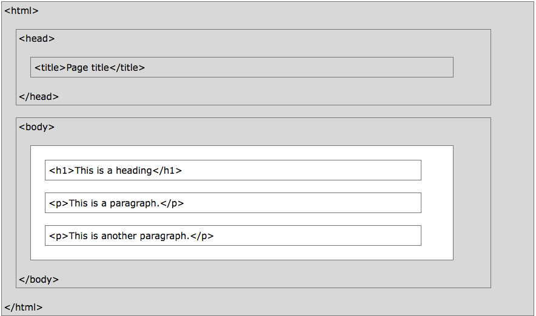

# Aula

## O que é HTML?
HTML é uma linguagem de marcação padrão para criar páginas da Web.

* HTML significa Hyper Text Markup Language
* O HTML descreve a estrutura das páginas da Web usando marcação.
* Os elementos HTML são os blocos de construção de páginas HTML.
* Os elementos HTML são representados por tags.
* As etiquetas (tags) HTML rotulam pedaços de conteúdo, como "cabeçalho", "parágrafo", "tabela", e assim por diante
* Os navegadores não exibem as tags HTML, mas usam-nas para renderizar o conteúdo da página

## Um documento HTML simples
Exemplo

```HTML
<!DOCTYPE html>
<html>
<head>
<title>Título da página</title>
</head>
<body>
  
<h1>Meu primeiro cabeçalho.</h1>
<p>Meu primeiro parágrafo.</p>
  
</body>
</html>
```
[Clique aqui para testar o código do exemplo acima](https://www.w3schools.com/code/tryit.asp?filename=FOXYJCVBZ72A)

Exemplo Explicado

* A declaração <! DOCTYPE html> define este documento como HTML5
* O elemento < html> é o elemento raiz de uma página HTML
* O elemento < head> contém meta-informações sobre o documento
* O elemento < title> especifica um título para o documento
* O elemento < body> contém o conteúdo da página visível
* O elemento < h1> define um título grande
* O elemento < p> define um parágrafo

## Tags HTML
As tags HTML são nomes de elementos rodeados por colchetes angulares:

< tagname> o conteúdo vai aqui ... </ tagname>

As tags HTML normalmente vêm em pares como < p> e </ p>
A primeira tag em um par é a tag de início, a segunda tag é a tag final
A tag final é escrita como a marca de início, mas com uma barra invertida ("/") inserida antes do nome da tag
Dica: A tag de início também é chamada de tag de abertura e a etiqueta final da tag de fechamento.

## Navegadores da Web
O objetivo de um navegador web (Chrome, IE, Firefox, Safari) é ler documentos HTML e exibi-los.

O navegador não exibe as tags HTML, mas as usa para determinar como exibir o documento.


## HTML Page Structure

Abaixo está uma visualização de uma estrutura de página HTML:


> **Nota:** Somente o conteúdo dentro da seção < body > (a área branca acima) é exibido em um navegador.
## A declaração <!DOCTYPE> 
A declaração <! DOCTYPE> representa o tipo de documento e ajuda os navegadores a exibir páginas da Web corretamente.

Ele só deve aparecer uma vez, no topo da página (antes de quaisquer tags HTML).

A declaração <! DOCTYPE> não diferencia maiúsculas de minúsculas.

A declaração <! DOCTYPE> para HTML5 é:

```HTML
<! DOCTYPE html>
```

## Versões do HTML
Desde os primeiros dias da web, houve muitas versões do HTML:

| Versão | 	Ano |
|---------|--------|
|HTML	    |1991    |
|HTML 2.0	|1995.   |
|HTML 3.2	|1997.   |
|HTML 4.01|	1999.  |
|XHTML	  |2000.   |
|HTML5	  |2014.   |


# Tradução
Este texto é uma tradução da pagina https://www.w3schools.com/html/html_intro.asp
