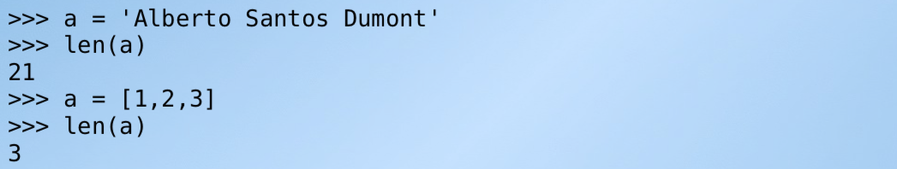

# Python: Resumo da sintaxe da linguagem python


## Identação para separar blocos

A sintaxe do python é bem limpa e enxuta. 
Python não precisa de chaves “{“ para abrir e nem para fechar blocos de comandos.
No entanto, python utiliza como alternativa a identação de blocos. Ou seja, um bloco é delimitado não por chaves, mas pela sua identação. Ou seja, a coluna onde o texto começa delimita o bloco.

Para ficar claro, observe alguns exemplos de comparação com a linguagem java:

<table><tr><th>JAVA</th><th>Python</th></tr>
<tr>
<td>

```java
{
   // isto é um bloco java
   int a=10;
}
```
</td>
<td>

```python
# isto é um bloco python
a=10
```
</td>
</tr>

<tr>
<td>

```java
{
   // este é o bloco principal
   int a=10;
   int b=1;

   if (b==3) {
       // este é bloco do if
       b=a*10;

   } else {
       // este é bloco do else 
       int a=100;
       b=a*10;
   }

   // aqui voltamos ao bloco principal
   System.out.print("O valor de b é " + b);
}
```
</td>
<td>

```python
# este é o bloco principal
a=10
b=1

if b == 3:
    # este é o bloco do if
    b=a*10

else:
    # este é o bloco do else
    a=100
    b=a*10

# aqui voltamos ao bloco principal
print("O valor de b é " + b)
```
</td>
</tr>
</table>

Ao usar identação como delimitador de blocos python força o programador a manter seu código sempre identado e organizado. Portanto, se o programador não identar o código python não funciona. Isto é uma das vantagens do python, mas pode ser incomodo no início, pois a maioria dos programadores estão acostumados com outras linguagens que permitem códigos não identados.
Por exemplo, observe a comparação abaixo:
<table><tr><th>Código JAVA não identado mas que funciona</th><th>Código Python com erro de identação</th></tr>
<tr>
<td>

```java
{
   // isto é um bloco java
   
   int a=10; // mesmo bloco
            int b = 12; // mesmo bloco
        int c = 40; // mesmo bloco
}
```
</td>
<td>

```python
# isto é um bloco python

a=10 # mesmo bloco
        b = 12 #  outro bloco 1
    c = 40 # outro bloco 2
```
</td>
</tr>
</table>

O código python acima não funciona, pois ele cria blocos novos em cada linha. Cada linha começa em uma coluna (identação) diferente da anterior. **Isto o python considera como um novo bloco**. Portanto, o código não funciona, pois novos blocos só devem ser criados para estruturas como ifs, fors, whiles e funções.

Já o código java acima funciona. Isto ocorre, pois todas as linhas estão no mesmo bloco. E apesar das linhas começarem em colunas diferentes elas não criam blocos novos. Em java blocos novos são criados com as chaves. Usamos "{" para abrir um bloco e "}" para fechar.


# Imprimindo texto na tela

Um programa python que imprime o texto "Bem-vindo!" na tela é bem simples de se fazer quando comprado com o mesmo programa equivalente Java:

<table><tr><th>Programa Java</th><th>Programa Python</th></tr>
<tr>
<td>

```java
public class Bemvindo {
    public static void main(String[] args) {
        System.out.print("Bem-vindo!");
    }
}
```
</td>
<td>

```python
print("Bem-vindo!")
```
</td>
</tr>
</table>

### Tipos de dados
O Python é uma linguagem não tipada (variáveis com valores dinâmicos), ou seja, não há a necessidade de declarar o tipo da variável. Assim, durante a execução do script uma variável pode receber valores do tipo “String” (texto) e, posteriormente, receber valores do tipo “int” (inteiro), "float"(real,fracionário) e até outros objetos.

Pode-se, ainda, “forçar” uma variável a receber um tipo determinado de dados. Exemplo:

```python
salario = str(900.0)
```
No exemplo acima, o valor float 900.00 está sendo forçado a virar um valor do tipo string, ou seja, o mesmo que “900.00”.

O inverso também pode ser feito, A string "900.0" pode ser convertida para um número do tipo float:
```python
salario = float("900.0")
```

No tópico a seguir, veremos mais sobre variáveis.

# Variaveis

Em Python, não é necessário declarar as variáveis, basta que o programador atribua um valor à variável e esta já estará guardada na memória. Para criar variáveis em Python é necessário seguir algumas regras:

* Os nomes das variáveis só podem conter letras, números e underline "_". 
* Os nomes de variáveis devem sempre começar com letra minúscula.
* Os nomes das variáveis são case sensitive, ou seja, diferem letras maiúsculas de minúsculas.
* **Não** podemos utilizar os seguintes nomes para váriaveis: 

Abaixo temos um exemplo de criação de variaveis em python. Neste exemplo foi criado três variáveis (x, y, e total) e em seguida impresso na tela os valores:

```python
x = 10
y = 8
total = x + y

print("A soma de " + x + " com " + y + " é igual a " + total)
```
O programa acima quando executado gera a seguinte resposta na tela:
```
A soma de 10 com 8 é igual a 18
```
Conforme se pode perceber, além de não declarar, também não informamos o tipo de dados das variáveis, pois isso não é necessário no Python.

Isso vale também para a criação de listas(array ou vetor) e dicionários de dados.
## Listas
Uma lista pode ser criada de várias formas:

### Listas (arrays) Forma 1

A primeira forma de criar uma lista é usando a funçao **list**. Veja o exemplo abaixo que cria uma lista de números 
```python
numeros = list(13,29,27,64,22)
````
#### Listas (arrays) Forma 2
Outra forma de criar uma lista é usando o caracter []. Veja
```python
numeros = [13,29,27,64,22]
```

### Acesso aos dados de listas
De posse de umalista podemos visualizar o conteúdo dela tendo como auxílio o caractere especial []. Vejamos alguns exemplos:

```python
print numeros[1] # vai imprimir o valor 29
print numeros[3] # vai imprimir o valor 64
print numeros[0] # vai imprimir o valor 13
```
**Observação**: os indices das listas em python começam na posição 0 (zero)

## Dicionários
Alem das listas, em python também podemos criar dicionários de dados que é uma estrutura de dados muito versátil e poderosa.

### Dicionários forma 1

A primeira forma de criar um dicionario é usando a funçao **dict**. Veja o exemplo abaixo que cria um dicionário vazio e em seguida insere chaves valores ao dicionário: 
```python
aluno = dict()
aluno["nome"] = "Pedro"
aluno["idade"] = 18
aluno["email"] = "pedro@gmail.com"
```
### Dicionários forma 2
Outra forma de criar dicionários é utilizando os carecteres de chaves {}.
Veja um exemplo:
```python
aluno = {
    "nome"  : "Pedro",
    "idade" : 18,
    "email" : "pedro@gmail.com"
} 
```


### Acesso aos dados de dicionários

Como visto acima, podemos inserir tanto string como números nos valores do dicionário. 

Para imprimir os dados do dicionário é simples. Ele segue a mesma notação da lista de usar [] para acessar os elementos. A diferença é que na lista usa-se números nos indices, mas no dicionário podemos usar strings(texto). 

Outra forma de imprimir os dados de um dicionário é utilizando a função **format** das strings.
Para isso, devemos passar o dicionario como parâmetro da função format e acrescentar os caracteres **\*\*** antes do nome do dicionário.

 Essa outra forma permite fazer um código mais limpo e organizado. Compare as duas formas

```python
# 1ª forma  de imprimir dados do dicionario
print "O aluno " + aluno["nome"] + " de " + aluno["idade"] + " anos tem email " + aluno["email"]

# 2ª forma de imprimir dados do dicionário
print " O aluno {nome} de {idade} anos tem email {email}".format(**aluno)
```
No exemplo acima, o código produz as seguintes mensagens na tela:
```
O aluno Pedro de 18 anos tem email pedro@gmail.com
O aluno Pedro de 18 anos tem email pedro@gmail.com
```

Podemos observar acima que ambas as formas imprimem os dados corretamente. Portanto, fica a cargo do programador escolher qual forma prefere utilizar em seu projeto.

# Concatenando valores
A concatenação de valores é uma técnica que auxilia muito as linguagens de programação. No Pythnon utilizamos o sinal de soma (+) para concatenar os valores. Veja:
```python
texto = "Olá mundo!" + " Sou novo aqui."
```
O código acima irá armazerar na memória uma variável chamada **texto** cujo o conteúdo concatenado é: **"Olá mundo! Sou novo aqui."**.

O mesmo vale para a concatenação de variáveis: 
```python
nome = "Charles"
texto = "Meu nome é " +  nome
```
O código acima irá armazerar na memória uma variável chamada **texto** cujo o conteúdo concatenado é: **"Meu nome é Charles**.

A concatenação também funciona com listas:
```python
lista1 = [1,2,3]
lista2 = [4,5]
lista3 = lista1 + lista2
```
O código acima irá armazerar na memória uma variável chamada **lista3** cujo o conteúdo concatenado é: **[1,2,3,4,5]**.

# Operadores
## Operadores Aritiméticos


## Operadores Condicionais


## Operadores Condicionais combinados


## Operadores Condicionais combinados com AND, OR e NOT


# Estruturas 
## IF
<table>
<tr><th>notação</th><th>Exemplo</th></tr>
<tr><td></td>
<td></td>
</tr></table>

## FOR
<table>
<tr><th>notação</th><th>Exemplo</th></tr>
<tr><td></td>
<td></td>
</tr></table>

## WHILE 
<table>
<tr><th>notação</th><th>Exemplo</th></tr>
<tr><td></td>
<td></td>
</tr></table>

# Funções

## Notaçao
<table>
<tr><th>notação</th><th>Exemplo</th></tr>
<tr><td></td>
<td></td>
</tr></table>

Funções podem ter parametros com valores padrão. Veja o exemplo:


E funções podem ter número de parametros variáveis:


# Funções úteis

## função len



## Bibliografia
http://turing.com.br/pydoc/2.7/tutorial/introduction.html
http://turing.com.br/pydoc/2.7/tutorial/modules.html
http://turing.com.br/pydoc/2.7/tutorial/controlflow.html
http://turing.com.br/pydoc/2.7/tutorial/datastructures.html


<!-- 
## Flask e Web
##Passsando informações entre paginas
## metodo GET e POST
### sessoes
### upload de arquivos 
-->


