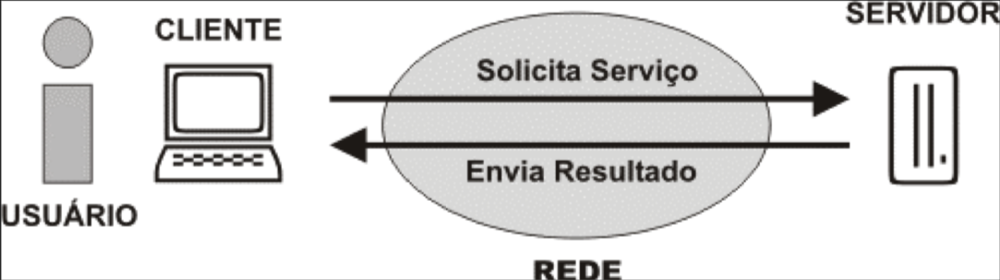
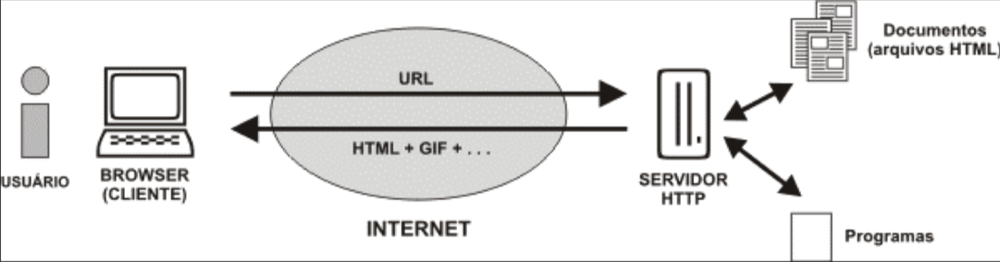

# Flask

Segue uma introdução sobre a transmissão de informações no framework web flask.  Aqui será apresentado:

 * Uma revisão da arquitetura Web
 * O processo de transmissão de dados do contexto do servidor para o contexto do cliente
 * O processo de transmissão de dados do contexto do cliente para o contexto do servidor

## A Arquitetura web

Na arquitetura web, temos uma divisão de responsabilidades em duas partes: **cliente** e  **servidor**. 
A figura abaixo exemplifica isso:


A parte do cliente é responsável por:

1. **Capturar** os dados da solicitação do serviço das mais diversas formas como: movimento do mouse, clicks, pressionamento de teclas, formulários de registro de dados, etc.
2. **Enviar** a solicitação do serviço ao servidor:
    * Por meio da URL (clicks em links e pelo método GET)
    * Por meio de formulários (métodos GET e POST)
    * Por meio de AJAX (o JavaScript assíncrono + XML)
3. **Apresentar** o resultado da solicitação do serviço:
    * Em formato textual: páginas informativas.
    * Em formato multimidia: páginas com videos, fotos e músicas.
    * Em formato interativo: páginas com animações e jogos.


A parte do servidor é responsável por:

1. **Validar** a solicitação do serviço. Ou seja, conferir se o pedido foi realizado corretamente. Se a solicitação estiver incorreta o servidor deve devolver ao cliente uma mensagem de erro. Se estiver correta, o servidor deve processar a solicitação.
2. **Processar** a solicitação do serviço. Por exemplo:
    * Armazernar, consultar, apagar e atualizar arquivos enviados pelos usuários (upload/download).
    * Armazenar, consultar, apagar e atualizar dados no banco de dados.
    * Construir e enviar as mensagens de emails.
    * Ligar, desligar, e comunicar com equipamentos eletrônicos conectados à internet. (Ex.: casas inteligentes, lâmpadas,  câmeras e sensores de vigilância)
   
3. **Enviar** o resultado do processamento ao cliente.

Para atender essas responsabilidades (tanto do cliente quanto do servidor) a arquitetura web utiliza três agentes: o **navegador**, o **servidor http** e a **internet**. 

A comunicação entre esses agentes pode ser vista na imagem abaixo:


O navegador executa as funções do cliente. Ou seja, captura dados, monta a solicitação e a envia ao servidor através da internet. Posteriormente, o navegador recebe o resultado do processamento da solicitação e a apresenta ao usuário.

O servidor http é um programa que entende o protocolo http. Ele recebe as solicitações do cliente e, de acordo com o tipo de solicitação, pode realizar duas operações:

 * **Operação primária**: fazer o download de arquivos estáticos **diretamente** (sem processamento de dados) para o cliente .
 * **Operação secundária**: redirecionar a solicitação para um outro programa que irá fazer o processamento de dados da solicitação. O programa, ao terminar o processamento, deve gerar uma resposta que será devolvida ao servidor http. Por fim, o servidor http envia ao cliente a resposta que recebeu do programa.

É importante observar que a comunicação entre servidor e cliente é realizada pelo intermédio da internet. E que o protocolo HTTP é **stateless**(sem estado). Ou seja, cada requisição (solicitação) que é feita pelo navegador é independente. 

Portanto,  quando o navegador fecha a conexão de internet (ao terminar de receber a resposta), toda a informação sobre aquela solicitação é perdida. Mesmo que várias requisições sejam enviadas pela mesma conexão de internet, uma requisição não sabe que a outra existe. Para o servidor, cada requisição é uma requisição diferente. 

Por padrão, não existe na requisição nenhuma informação que guarde o estado atual do site. Logo, fica a cargo do programador gerenciar o estado de sua aplicação ou website.

## Transmissão de informações

Na programação web quando transmitimos dados devemos levar em consideração a arquitetura web. Por exemplo, se quizermos postar um comentário em uma página de um blog o processo de transmissão de informações segue a seguinte ordem:

1. **Capturar solicitação**: O navegador(cliente) exibe um página do blog com um formulário para os visitantes deixarem seus comentários. O visitante preenche o formulário com o seu nome e comentário.
2. **Enviar solicitação**: O visitante clica num botão "enviar comentário". E o formulário se encarrega de enviar a solicitação pela internet.
3. **Validar solicitação**: O servidor http valida a solicitação e a encaminha para o programa reponsável pelo processamento de dados das solicitações.
4. **Processamento**: o programa obtem, das informações que foram anexadas à solicitação, o "nome" e o "comentário" que o visitante digitou no formulário. O programa armazena essas informações no banco de dados. E Por fim, o programa monta, como resposta, uma página html com o conteúdo da página e todos os comentários relativos aquela página que estão armazenados no banco de dados.
5. **Enviar resultado**: o servidor http envia a nova pagina html para o cliente através da internet.
6. **Apresentar resultado**: o navegador(cliente), ao receber os dados da nova pagina html recarrega-se e a exibe. O usuário, agora, vê seu comentário adicionado a lista de comentários. E o formulário, que antes estava preenchido, apresenta-se novamente em branco esperando por comentários dos visitantes.

No processo acima ocorre 4 formas de transmissão de informações:

* **Transmissão de dados do usuário para a linguagem client-side**: ou seja, o preenchimento do formulário com os comentários do visitante. A tag **form** do html juntamente com as tags **input** são as responsáveis por isso.
* **Transmissão de dados da linguagem cliente para processamento na linguagem do servidor**: ou seja, a extração dos dados enviados pelo formulário no programa do servidor http.
* **Transmissão de dados para o banco de dados**: os dados extraídos do formulário no servidor são armazenados no banco de dados.
* **Transmissão de dados do servidor para o cliente**: os dados do banco de dados  (como a publicação e seus comentários) são utilizados para montar um nova página web que será exibida pelo cliente.

### Transmissão de dados do servidor para o cliente

No flask, as páginas html da pasta templates são o local onde colocamos o código do cliente,ou seja, o código que será apresentado/executado no navegador. É nela que incluímos os scripts da linguagem JavaScript. No entanto, algumas vezes precisamos transmitir dados que estão no servidor para serem visualizados no cliente (navegador).

Esse tipo de transmissão é feita no flask através de **variáveis de servidor** e **parâmetros de templates**. Para exemplificar vamos criar um projeto simples de exemplo.

Crie uma pasta "site" na pasta "c:\" e crie os arquivos padrões de um projeto flask básico (arquivos app.py e inicia-servidor.bat).

Altere o arquivo app.py para colocar o seguinte código:

```python
#coding: UTF-8
from flask import Flask, render_template, request

app =  Flask(__name__)

@app.route("/")
def pagina_index():
    return render_template("index.html")
```

Crie também a pasta **templates** e dentro dela crie um arquivo html de nome "index.html" com o seguinte conteúdo:

```html
<!DOCTYPE html>
<html lang="pt-br">
  <head>
    <title>Detector de IP</title>
    <meta charset="utf-8">
  </head
  <body>
    <h2>Seja bem-vindo visitante!</h2>

    <p>Detectamos que seu ip é {{ ip_do_visitante }} </p>
  </body>
</html>
```

Inicie o servidor e acesse o projeto no endereço http://localhost/. 
Obserque que a pagina irá exibir a mensagem incompleta **"Detectamos que seu ip é "**, mas não mostrará o IP da do nosso computador. Além disso, ela não irá exibir o trecho **{{ ip_do_visitante }}** que colocamos no html. Isso acontece, pois no flask temos uma notação especial para parâmetros de templates. 

Essa notação diz que um parâmetro de template deve estar entre chaves duplas: **{{ parâmetro }}**

O framework flask, antes de enviar o html para o navegador, procura no template html pela existência de parâmetros de templates. Se o flask encontrar algum parâmetro ele substitui o trecho "{{ parâmetro }}" pelo valor correspondente aquele parâmetro.

No nosso exemplo, o html tem apenas um parâmetro de template chamado **ip_do_visitante**. Assim, quando nós acessamos a pagina, o flask encontrou o parâmetro e o substituiu pelo seu valor. No entanto, como ainda não tinhamos definido nenhum valor para esse parâmetro o flask considerou que o valor dele era "vazio" e, por isso, não imprimiu o ip na página.

Para corrigir isso precisamos definir um valor para o parâmetro ip_do_visitante. Os valores dos parâmetros de templates são definidos na função "render_template" que exibe o template. Portanto, altere o arquivo app.py para que fique igual ao código abaixo:

```python {class="line-numbers"}
#coding: UTF-8
from flask import Flask, render_template, request

app =  Flask(__name__)

@app.route("/")
def pagina_index():
    ip_do_visitante = request.remote_addr
    return render_template("index.html", **locals() )
```

O que mudamos foi as **linhas 8 e 9**. E agora, se acessarmos novamente o endereço http://localhost/, o site irá exibir o ip que foi detectado.  

Isso foi possível, pois na linha 8 definimos o valor parâmetro de template **ip_do_visitante**. O valor dessa variável é igual a propriedade "remote_addr" do objeto "request" que foi fornecido pelo framework flask (ver import da linha 2).

No entanto, só criar a variável não resolve o nosso problema. Precisamos dizer ao flask que o valor do nosso parâmetro de template (ip_do_visitante) é igual ao valor dessa variável. Por isso, na linha 9, acrescentamos um parâmetro **\*\*locals()** à função **render_template**.

No flask essa é a unica forma que temos de transmitir informação do contexto da linguagem do servidor (python) para o contexto do cliente (HTML/Javascript/css). De início pode parecer um pouco limitante, mas na verdade é uma forma bem poderosa e versátil.

Os parâmetros de templates podem possuir qualquer valor, pois aceitam ser igualados a qualquer variável python. No exemplo acima o parâmetro foi igualado a um número IP, mas ele poderia ser igualado a qualquer valor de variável python. Exemplo: um texto, um número decimal, um objeto ou uma lista de objetos de qualquer tipo.

Para mais informações sobre como manipular dados do servidor nos templates html do flask veja a [documentação dos templates flask](http://jinja.pocoo.org/docs/2.10/templates/).

### Transmissão de dados do cliente para o servidor

Na arquitetura web temos três formas de transmitir dados do cliente para o servidor:

1. Por meio da estrutura da URL da página.
2. Por meio de argumentos GET na URL da página.
3. Por meio de valores POST enviados por formulários.

O framework Flask suporta esses três tipos de transmissão de dados.

#### Transmissão pela estrutura da url

No flask podemos passar dados na URL da página que estamos acessando. Para isso basta adicionar uma rota com parâmetros. 

Por exemplo, imagine que tenhamos uma rota *"/usuario/"* que exibe uma página sobre um usuário do nosso site. Precisamos adicionar uma mecanismo para mostrar informações de um usuario específico nesta rota, mas sem ter registrar uma rota diferente para cada usuário no arquivo app.py, pois não seria muito prático.

Assim sendo, poderíamos ter uma rota "/usuario/1/" para mostrar os dados do usuário de código 1, uma rota "/usuario/100/" para mostrar os dados do usuário de código 100 e assim sucessivamente para cada usuário. Mas todas essas rotas seriam redirecionadas para um unica rota genérica e função python no arquivo app.py.

 Esse tipo de rota pode ser expresso no flask da seguinte forma: "/usuario/**\<codigo\>**/".

Assim sendo, as rotas dos usuarios poderiam ser implementadas no arquivo app.py como uma unica rota genérica da seguinte forma:

```python
@app.route("/usuario/<codigo>/")
def usuario(codigo):
    return "o código do usuario é: " + codigo
```

#### Transmissão por argumentos GET na URL

Na web quando um formulário envia dados utilizando o método GET os dados são enviados pela URL seguindo o seguinte padrão:

 URL **?** argumento1 **=** valor1 **&** argumento2 **=** valor2 **&** ... **&** argumentoN **=** valorN 

Assim sendo, em vez de usar uma rota genérica com parâmetros (como no método de transmissão anterior) podemos utilizar uma rota genérica comum e enviar dados via argumentos GET.

A rota "/usuario/\<codigo\>/", neste caso, passaria a ser apenas "/usuario/". Mas ao acessar ela no navegador poderíamos acrescentar os argumentos GET para diferenciar entre os varios usuários da seguinte forma:  **"/usuario/?codigo=valor"**.

Logo para acessar a rota "/usuario/1/" poderiámos usar **"/usuario/?codigo=1"**.

Assim sendo a rota para exibir a informação de um usuário específico poderia ser registrada no arquivo app.py da seguinte forma:

```python {class="line-numbers"}
@app.route("/usuario/")
def usuario():
    codigo = request.args.get("codigo")
    return "o código do usuario é: " + codigo
```

No exemplo acima, a linha 3 é responsável por extrair da URL valor do argumento GET de nome "código" e criar uma variável de servidor de nome codigo. Para fazer essa extração foi utilizado a função **request.args.get()**. Essa função retorna o valor do argumento GET que tiver o nome passado para ela como parâmetro. 

Assim sendo, se uma URL tivesse três argumentos como por exemplo:
 **/dados_pessoais/?nome=José&idade=20&sexo=masculino**
 esses dados poderiam ser extraídos usando o seguinte código para a rota no arquivo app.py:

```python
@app.route("/dados_pessoais/")
def dados():
    nome = request.args.get("nome")
    x = request.args.get("idade")
    y = request.args.get("sexo")
    return render_template("dados.html", **locals() )
```
O template dados.html poderia exibir os dados extraídos usando os parâmetros de template da seguinte forma:

```html
<!DOCTYPE html>
<html lang="pt-br">
  <head>
    <title>Dados Cadastrais</title>
    <meta charset="utf-8">
  </head
  <body>
    <h2>Dados Cadastrais</h2>

    <p>O usuário {{ nome }} tem {{ x }} anos de idade e é do sexo {{ y }} </p>

  </body>
</html>

```

#### Transmissão de valores POST enviados por formulários

A transmissão de valores post ocorre de forma semelhante a transmissão de argumentos GET. Mas com as seguintes diferenças:

1. Valores enviados por formulários através do método POST não ficam visíveis na URL do navegador. E portanto, oferecem um forma mais segura de envio de dados.
2. a tag **form** do html obrigatóriamente deve possuir o atributo **method="POST"**
3. No flask, para extrair os dados enviados pelo metódo POST utilizamos a função **request.form.get()** e não a função request.args.get que é utilizada apenas pelo método get.
4. No flask, ao registrar uma rota que aceita o metodo POST o programador deve adicionar um segundo parâmetro **methods=["POST"]** à função **@app.route()**.

Para exemplificar, consideremos um site com duas rotas:

* "/formulario/": que exibe um formulário para informarmos os dados do usuário.
* "/dados_pessoais/": que exibe os dados enviados via metodo POST para o servidor.

O arquivo app.py deverá ter o código abaixo:

```python {class="line-numbers"}
#coding: UTF-8
from flask import Flask, render_template, request

app =  Flask(__name__)

@app.route("/formulario/")
def formulario():
    return render_template("formulario.html")

@app.route("/dados_pessoais/", methods=["POST"])
def dados():
    nome = request.form.get("nome")
    x = request.form.get("idade")
    y = request.form.get("sexo")
    return render_template("dados.html", **locals() )
```

O template **dados.html** é idêntico ao do exemplo anterior com argumentos GET.
Já o template formulario.html deve possuir um código semelhante ao código abaixo:

```html
<!DOCTYPE html>
<html lang="pt-br">
  <head>
    <title>Cadastro</title>
    <meta charset="utf-8">
  </head
  <body>
    <h2>Cadastro</h2>

    <form  action="/dados_pessoais/" method="POST">

        <p> Nome: <input type="text" name="nome"></p>
        <p> Idade: <input type="text" name="idade"></p>
        <p> Nome: <input type="text" name="sexo"></p>

        <p> <input type="submit" value="enviar"> </p>
    </form>
  </body>
</html>
```

Para evitar erros de envio de formulários, é importante sempre conferir os valores dos atributos **action** e **method** da tag form. E os valores dos atributos **type**,**name** e **value** das tags inputs. Devemos tomar cuidado especial com atributo **name** das tags inputs, pois ele será o identificador que utilizaremos nas funções *request.args.get* e *request.form.get* do flask.

# Bibliografia

Flask - Documentação do Objeto request http://flask.pocoo.org/docs/1.0/api/#incoming-request-data 
Flask - Documentação dos templates: http://jinja.pocoo.org/docs/2.10/templates/
