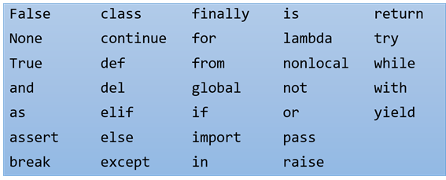

# Python: Resumo da sintaxe da linguagem


## Indentação para separar blocos

A sintaxe do python é bem limpa e enxuta. Python não precisa de chaves ({) para abrir blocos de comandos e nem para fechar blocos de comandos.

No entanto, python utiliza como alternativa a indentação de blocos. Ou seja, um bloco é delimitado não por chaves, mas pela sua indentação. Ou seja, a coluna onde o texto começa delimita o bloco.

Para ficar claro, observe alguns exemplos de comparação com a linguagem Java:

<table><tr><th>JAVA</th><th>Python</th></tr>
<tr>
<td>

```java
{
   // isto é um bloco java
   int a=10;
}
```
</td>
<td>

```python
# isto é um bloco python
a=10
```
</td>
</tr>
</table>

<table><tr><th>JAVA</th><th>Python</th></tr>
<tr>
<td>

```java
{
   // este é o bloco principal
   int a=10;
   int b=1;

   if (b==3) {
       // este é bloco do if
       b=a*10;

   } else {
       // este é bloco do else 
       int a=100;
       b=a*10;
   }

   // aqui voltamos ao bloco principal
   System.out.print("O valor de b é " + b);
}
```
</td>
<td>

```python
# este é o bloco principal
a=10
b=1

if b == 3:
    # este é o bloco do if
    b=a*10

else:
    # este é o bloco do else
    a=100
    b=a*10

# aqui voltamos ao bloco principal
print("O valor de b é " + b)
```
</td>
</tr>
</table>

Ao usar indentação como delimitador de blocos a linguagem Python força o programador a manter seu código sempre indentado e organizado. **Se o programador não indentar o código o programa python não funciona**. 

A primeira vista pode não parecer, mas forçar a identação é uma das vantagens do Python. Por exemplo, observe os códigos abaixo:
<table><tr><th>Código JAVA não indentado mas que funciona</th><th>Código Python com erro de indentação</th></tr>
<tr>
<td>

```java
{
   // isto é um bloco java
   
   int a=10; // mesmo bloco
            int b = 12; // mesmo bloco
        int c = 40; // mesmo bloco
}
```
</td>
<td>

```python
# isto é um bloco python

a=10 # mesmo bloco
        b = 12 #  outro bloco 1
    c = 40 # outro bloco 2
```
</td>
</tr>
</table>

O código python acima não funciona, pois ele cria blocos novos em cada linha. Cada linha começa em uma coluna (indentação) diferente da anterior. **Isso o python considera como um novo bloco**. Portanto, o código não funciona, pois novos blocos só devem ser criados para estruturas como ifs, fors, whiles e funções.

Já o código Java acima funciona. Isso ocorre, pois todas as linhas estão no mesmo bloco. E apesar das linhas começarem em colunas diferentes elas não criam blocos novos. Em java blocos novos são criados com as chaves. Usamos "{" para abrir um bloco e "}" para fechar.


# Imprimindo texto na tela

Um programa python que imprime o texto **"Bem-vindo!"** na tela é relativamente simples quando comprado com o mesmo programa equivalente Java:

<table><tr><th>Programa Java</th><th>Programa Python</th></tr>
<tr>
<td>

```java
public class Bemvindo {
    public static void main(String[] args) {
        System.out.print("Bem-vindo!");
    }
}
```
</td>
<td>

```python
print("Bem-vindo!")
```
</td>
</tr>
</table>

# Tipos de dados
O Python é uma linguagem não tipada (variáveis com valores dinâmicos), ou seja, não há a necessidade de declarar o tipo da variável. Assim, durante a execução do script, uma variável pode receber valores do tipo “String” (texto) e, posteriormente, receber valores do tipo “int” (inteiro), "float"(real,fracionário) e até outros objetos.

Pode-se, ainda, “forçar” uma variável a receber um tipo determinado de dados. Veja o exemplo:

```python
salario = str(900.0)
```
No exemplo acima, o valor float **900.0** está sendo forçado a virar um valor do tipo string, ou seja, o mesmo que **“900.0”**.

O inverso também pode ser feito, a string **"900.0"** pode ser convertida para um número do tipo float:
```python
salario = float("900.0")
```

# Variaveis

Na linguagem Python não é necessário declararmos as variáveis antecipadamente, pois basta que o programador atribua um valor à variável e esta já estará guardada na memória. Para criar variáveis em Python é necessário seguir algumas regras:

* Os nomes das variáveis só podem conter letras, números e underline "_". 
* Os nomes de variáveis devem sempre começar com letra minúscula.
* Os nomes das variáveis são case sensitive, ou seja, diferem letras maiúsculas de minúsculas.
* É proibido utilizar os seguintes nomes para váriaveis: 

Abaixo temos um exemplo de criação de variáveis em python. Neste exemplo foi criado três variáveis (**x**, **y**, e **total**) e em seguida impresso na tela os valores correspondentes:

```python
x = 10
y = 8
total = x + y

print("A soma de " + x + " com " + y + " é igual a " + total)
```
O programa acima quando executado gera a seguinte resposta na tela:
```
A soma de 10 com 8 é igual a 18
```

Conforme podemos perceber, além de não declarar, também não informamos o tipo de dados das variáveis, pois isso também não é necessário no Python.

Isso vale também para a criação de listas(array ou vetor) e dicionários de dados.
# Estruturas de dados

Python possue diversas estruturas de dados. As mais utilizadas são as listas e os dicionários.

## Listas
Uma lista é uma sequência de objetos python. É Algo parecido com o ArrayList do Java.

No python ainda temos a vantagem de poder ter uma lista de objetos de tipos variados.

A primeira forma de criar uma lista é usando a funçao **list**. Veja o exemplo abaixo que cria uma lista de números 
```python
numeros = list(13,29,27,64,22)
````

Outra forma de criar uma lista é usando o caracter []. Veja
```python
numeros = [13,29,27,64,22]
```

De posse de uma lista podemos visualizar o conteúdo dela tendo como auxílio o caractere especial []. Vejamos alguns exemplos:

```python
print numeros[1] # vai imprimir o valor 29
print numeros[3] # vai imprimir o valor 64
print numeros[0] # vai imprimir o valor 13
```
**Observação**: os indices das listas em python começam na posição 0 (zero)


## Dicionários
Além das listas, em python também podemos criar dicionários de dados que é uma estrutura de dados muito versátil e poderosa.

A primeira forma de criar um dicionario é usando a funçao **dict**. Veja o exemplo abaixo que cria um dicionário vazio e em seguida insere chaves e valores ao dicionário:

```python
aluno = dict()
aluno["nome"] = "Pedro"
aluno["idade"] = 18
aluno["email"] = "pedro@gmail.com"
```

Outra forma de criar dicionários é utilizando os carecteres de chaves {}.
Veja um exemplo:
```python
aluno = {
    "nome"  : "Pedro",
    "idade" : 18,
    "email" : "pedro@gmail.com"
} 
```

Para imprimir os dados do dicionário é simples. Ele segue a mesma Notação da lista de usar [] para acessar os elementos. A diferença é que na lista usamos números nos indices, mas no dicionário podemos usar strings(texto) também. 

Outra forma de imprimir os dados de um dicionário é utilizando a função **format** das strings.
Para isso, devemos passar o dicionario como parâmetro da função format e acrescentar os caracteres **\*\*** antes do nome do dicionário. Essa outra forma permite fazer um código mais limpo e organizado. Compare as duas formas:

```python
# 1ª forma  de imprimir dados do dicionario
print "O aluno " + aluno["nome"] + " de " + aluno["idade"] + " anos tem email " + aluno["email"]

# 2ª forma de imprimir dados do dicionário
print " O aluno {nome} de {idade} anos tem email {email}".format(**aluno)
```

No exemplo acima, o código produz as seguintes mensagens na tela:

```bash
O aluno Pedro de 18 anos tem email pedro@gmail.com
O aluno Pedro de 18 anos tem email pedro@gmail.com
```

Podemos observar acima que ambas as formas imprimem os dados corretamente. Portanto, fica a cargo do programador escolher qual forma prefere utilizar em seu projeto.

# Concatenando valores

A concatenação de valores é uma técnica que auxilia muito as linguagens de programação. No Python utilizamos o sinal de soma (+) para concatenar os valores. Veja:

```python
texto = "Olá mundo!" + " Sou novo aqui."
```

O código acima irá armazerar na memória uma variável chamada **texto** cujo o conteúdo concatenado é: **"Olá mundo! Sou novo aqui."**.

O mesmo vale para a concatenação de variáveis: 
```python
nome = "Charles"
texto = "Meu nome é " +  nome
```
O código acima irá armazerar na memória uma variável chamada **texto** cujo o conteúdo concatenado é: **"Meu nome é Charles"**.

A concatenação também funciona com listas:
```python
lista1 = [1,2,3]
lista2 = [4,5]
lista3 = lista1 + lista2
```
O código acima irá armazerar na memória uma variável chamada **lista3** cujo o conteúdo concatenado é: **[1,2,3,4,5]**.

# Operadores

## Operadores Aritiméticos

```python 
>>> 7 + 3               # Adição
10
>>> 7 - 3               # subtração
4
>>> 8 % 3               # resto da divisão
2
>>> 8 / 3               # divisão inteira
2
>>> 8 / 3.              # divisão em ponto flutuante
2.6666666666666665
>>> 8 * 3               # produto
24
>>> 8 ** 2              # exponenciação
64

```

## Operadores Condicionais

```python
>>> 2 == 4
False
>>> 2 != 4
True
>>> 2 > 4
False
>>> 2 < 4
True
>>> 3 <= 3
True
```

## Operadores Condicionais combinados

```python
>>> a = 5
>>> b = 3
>>> 0 < a < b       # avaliação é feita da esquerda para direita
False
>>> 0 < a > b
True
```

## Operadores Condicionais combinados com AND, OR e NOT

```python
>>> nome = 'pedro''
>>> idade = 25
>>> nome == 'pedro' and idade == 25
True
>>> len(nome) < 10 and idade > 30
False
>>> len(nome) < 10 and idade > 30
True
```


# Estruturas 
## IF
<table>
<tr><th>Notação</th><th>Exemplo</th></tr>
<tr><td>

```python
if condição:
    # comandos
    ...
elif condição:
    # comandos
    ...
else:
    # comandos
    ...
```

</td>
<td>

```python
>>> a = 5
>>> b = 8
>>> if a > b:
...      print "a é maior que b"
...     c = "maior que "
... elif a == b:
...     print "a é igual a b"
...     c = "igual a "
... else:
...     print "a é menor que b"
...     c = "menor que "
a é menor que b
>>> print a, c, b
5 menor que 8
```

</td>
</tr></table>

## FOR
<table>
<tr><th>Notação</th><th>Exemplo</th></tr>
<tr><td>

```python
for variavel in sequência:
    # comandos
    ...
```

</td>
<td>


```python 
>>> lista = ["pedra", 12, 54.5, 3]
>>> for item in lista:
...     print item
pedra
12
54.5
3
>>> for i in range(2,5):
...     print i
1
2
3
4
```
</td>
</tr></table>

## WHILE 
<table>
<tr><th>Notação</th><th>Exemplo</th></tr>
<tr><td>

```python
while condição:
    # comandos
    ...
```
</td>
<td>


```python
>>> m = 3 * 19
>>> n = 5 * 13
>>> contador = 0
>>> while m < n:
...    m = n / 0.5
...    n = m / 0.5
...    contador += 1
>>> print "Foram %d interações" % contador
Foram 510 interações
```

</td>
</tr></table>

# Funções

## Notação
<table>
<tr><th>Notação</th><th>Exemplo</th></tr>
<tr><td>

```python
def nome_da_função(arg1, arg2, ... , argN):
    # código da função
    return valor_de_retorno   # return é opcional
```

</td>
<td>


```python
>>> def fibonacci(n):
...     a = 0
...     b = 1 
...     while b < n:
...         print b,
...         a = b
...         b = a + b
>>> fibonacci(100)
1 1 2 3 5 8 13 21 34 55 89
```
</td>
</tr></table>

## Parametros com valores padrão
Funções podem ter parametros com valores padrão. Veja o exemplo:
```python {class="line-numbers"}
>>> def aplicar_multa(valor, taxa = 0.15):
...    return valor*(1.0 + taxa)
...
>>> print "Valor a pagar: %5.2f" % aplicar_multa(100)
115.00
>>> print "Valor a pagar: %5.2f" % aplicar_multa(100,0.25)
125.00
```
No exemplo acima, a função **aplicar_multa** tem dois parametros: **valor** e **taxa**. No entanto, o segundo parametro (taxa) tem uma valor padrão (**0.15**). Isso implica que ao chamarmos a função não precisamos passar o segundo parametro se o valor dele for igual ao valor padrão(linha 4). Neste caso,  a função considera como valor padrão a taxa de 15%. 

Na linha 6, temos outro caso onde trocamos o valor da taxa passando como parametro o novo valor 0.25 (25%).

## Funções com número de parametros variáveis

E funções podem ter número de parâmetros variáveis:
```python
>>> def media(*valores):
...     soma = 0.0
...     for n in valores:
...         soma += n
...     return soma / len(valores)
...
>>> media (1,2,3,4,5,6)
3.5
```

No exemplo acima, que calcula a media dos valores passados omo parâmetros, os parametros são informados a função na forma de uma lista de nome **\*valores**.

Observe que foi necessário acrescentar o **"\*"** antes da palavra valores. Isso foi feito para informar a função **media** que a variável **valores** não é um parâmetro simples e mas sim vários parâmetros.


## Função len
A função **len** é uma  função muito útil que pode ser utilizada para saber o comprimento de uma string ou número de elementos de lista. Veja o exemplo:
```python
>>> nome = 'Alberto Santos Dumont'
>>> len(nome)
21
>>> lista = [1, 2, 3]
>>> len(lista)
3
```

## Bibliografia
Referência da linguagem em português:
http://turing.com.br/pydoc/2.7/tutorial/introduction.html
http://turing.com.br/pydoc/2.7/tutorial/modules.html
http://turing.com.br/pydoc/2.7/tutorial/controlflow.html
http://turing.com.br/pydoc/2.7/tutorial/datastructures.html

Apostila de python da UFRJ: http://www.dcc.ufrj.br/~fabiom/python/pythonbasico.pdf


<!-- 
## Flask e Web
##Passsando informações entre paginas
## metodo GET e POST
### sessoes
### upload de arquivos 
-->


